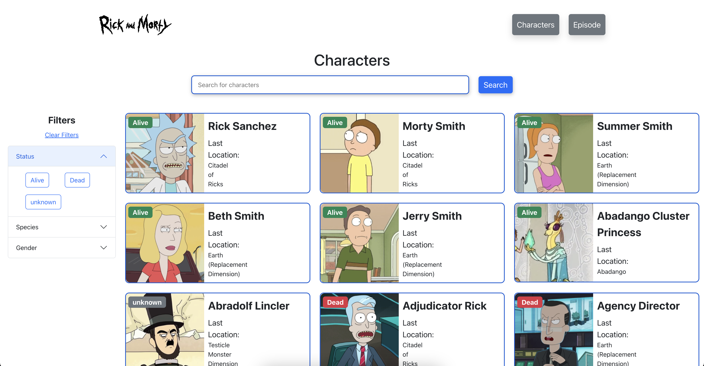
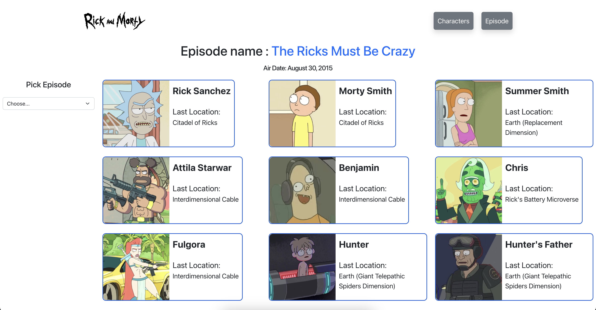

# Rick and Morty Wiki React APP

## Screenshots

## Setup

- React

## Tools

- Vite
- ReactQuery
- ReactRouter
- Bootstrap
- ReactPaginate

## Features

- Listing returned characters with API.
- Searching characters in the list with search input
- Filtering characters as dead, alive and unknown
- Searching characters according to episode number

## API

`API Linki: https://rickandmortyapi.com/api/character`

## Beginning

Clone this repository on your local machine.
 
`git clone https://github.com/umutzengi/rickviki.git`

## Use

To use it after cloning the project:
 
`cd rickviki`
 
`code .`
 
Run the following commands in the project folder to install the project dependencies.
 
`npm install`
 
`npm run dev`
 
Open your browser then go localhost:5173
